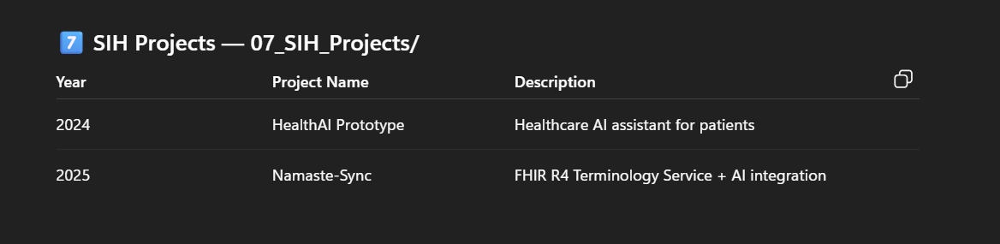
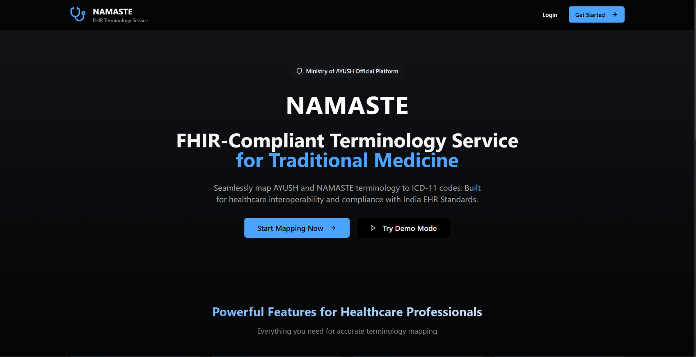
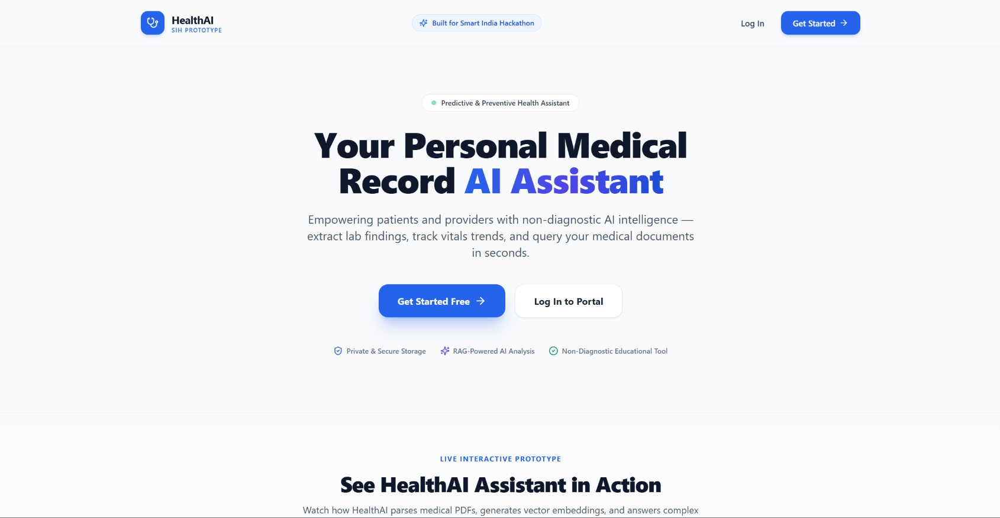

# SIH Projects

<p align="center">
  
</p>

<p align="center">
  <strong>Smart India Hackathon — Problem Statement Solutions</strong>
</p>

<p align="center">
  An index of Smart India Hackathon projects. Each project lives in its own repository — this repo is the map.
</p>

---

## How this repo works

This is a **parent / index repo**. It does not contain source code. Each row below links out to a standalone repository with its own full README, source, build instructions, and (if applicable) a live deployment.

```
07_SIH_Projects/
├── Public/
│   ├── Image/        # thumbnails + banner used in this README
│   └── Videos/        # demo clips for each project (added progressively)
├── .gitignore
└── README.md
```

---

## Projects

| Project | Description | Repo | Live Demo | Preview | Video |
|:--------|:-------------|:-----|:----------|:--------|:------|
| Fhir-Tech | A healthcare data management system| [Fhir-Tech](https://github.com/Mr-Anonymous-Guy/Fhir-Tech) | [Live](https://fhir-tech.vercel.app/) |  |[▶ Watch Demo](Public/Videos/Fhir-Tech.mp4?raw = true) |
| Healthcare AI Prototype | Comprehensive, privacy-first healthcare AI platform| [Healthcare_AI_Prototype](https://github.com/Mr-Anonymous-Guy/Healthcare_AI_Prototype) | [Live](https://healthcare-ai-nu.vercel.app/) |  |[▶ Watch Demo](Public/Videos/Healthcare_AI_Prototype.mp4?raw=true) |

---

## Author

**Mr-Anonymous-Guy**

| Platform | Link |
|:---------|:-----|
| GitHub | [Mr-Anonymous-Guy](https://github.com/Mr-Anonymous-Guy) |

---

## License

This repository is licensed under the **MIT License**.
